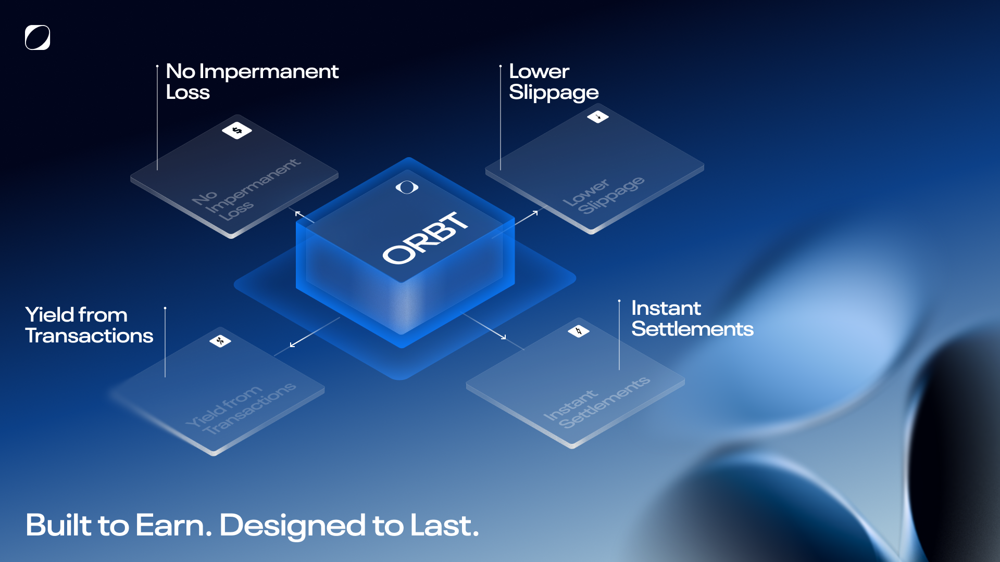

# ORBT. The Unified Liquidity Layer.


{% column width="50%" %}
## What is ORBT

ORBT is a Unified Liquidity Layer and modular stablecoin architecture that mints 1:1 0xAssets (0xUSD, 0xBTC, 0xETH), routes excess reserves into pre-funded, intent-based settlements, and streams fee-backed yield back to s0xAsset holders.

<a href="https://app.gitbook.com/s/lsMc3qArhr9xf4DrQteO/introduction/orbt-overview" class="button primary">Read the Overview</a> <a href="https://app.gitbook.com/s/lsMc3qArhr9xf4DrQteO/introduction/how-orbt-works" class="button secondary">Read How ORBT Works</a>


{% column width="50%" %}
<figure><figcaption></figcaption></figure>



## ORBT Key Components

<table data-view="cards"><thead><tr><th></th><th></th><th data-hidden data-card-target data-type="content-ref"></th><th data-hidden data-card-cover data-type="image">Cover image</th></tr></thead><tbody><tr><td><strong>Unified Liquidty Layer (ULL)</strong></td><td>The Unified Liquidity Layer connects liquidity from multiple sources into a single, unified pool.</td><td><a href="https://app.gitbook.com/s/lsMc3qArhr9xf4DrQteO/orbt-design/unified-liquidity-layer">Unified Liquidity Layer</a></td><td data-object-fit="contain"><a href=".gitbook/assets/Group 1000006249 (1).png">Group 1000006249 (1).png</a></td></tr><tr><td><strong>Unified Collateral Engine (UCE)</strong></td><td>The Unified Collateral Engine manages the collateral used within the ORBT protocol.</td><td><a href="https://app.gitbook.com/s/lsMc3qArhr9xf4DrQteO/orbt-design/uce">UCE</a></td><td data-object-fit="contain"><a href=".gitbook/assets/Group 1000006249.png">Group 1000006249.png</a></td></tr><tr><td><strong>User Savings Module (USM)</strong></td><td>The User Savings Module allows ORBT users to supply their 0xAssets and earn rewards. </td><td><a href="https://app.gitbook.com/s/lsMc3qArhr9xf4DrQteO/orbt-design/usm">USM</a></td><td data-object-fit="contain"><a href=".gitbook/assets/Group 1000006249 (2).png">Group 1000006249 (2).png</a></td></tr><tr><td><strong>$ORBT Governance</strong></td><td>$ORBT is the native governance token of the ORBT ecosystem.</td><td><a href="https://app.gitbook.com/s/lsMc3qArhr9xf4DrQteO/introduction/orbt/tokenomics-and-emission-schedule">Tokenomics &#x26; Emission Schedule</a></td><td data-object-fit="contain"><a href=".gitbook/assets/Group 1000006158 (1).png">Group 1000006158 (1).png</a></td></tr><tr><td><strong>0xAssets | s0xAssets</strong></td><td>1:1 synthetic assets (0xUSD, 0xBTC, 0xETH) and their savings wrappers (s0xUSD, s0xBTC, s0xETH) that earn fee-backed yield.</td><td><a href="https://app.gitbook.com/s/lsMc3qArhr9xf4DrQteO/orbt-design/0xassets">0xAssets</a></td><td data-object-fit="contain"><a href=".gitbook/assets/Group 1000006249 (4).png">Group 1000006249 (4).png</a></td></tr><tr><td><strong>Pockets, Strategies, Allocators</strong></td><td>Smart-contract pockets, yield strategies, and professional allocators that deploy 0xAssets into markets and settlements to generate fee-backed yield.</td><td><a href="https://app.gitbook.com/s/lsMc3qArhr9xf4DrQteO/orbt-design/pocket">Pocket</a></td><td data-object-fit="contain"><a href=".gitbook/assets/Group 1000006249 (3).png">Group 1000006249 (3).png</a></td></tr></tbody></table>

<figure><figcaption></figcaption></figure>

## Choose Your Path

<table data-view="cards"><thead><tr><th></th><th></th><th data-hidden data-card-target data-type="content-ref"></th><th data-hidden data-card-cover data-type="image">Cover image</th></tr></thead><tbody><tr><td><strong>DeFi Users &#x26; Treasuries</strong></td><td>Earn fee-backed yield on your stablecoins with 0xUSD / s0xUSD while keeping 1:1 liquidity and simple exits.</td><td><a href="https://app.gitbook.com/s/lsMc3qArhr9xf4DrQteO/protocol-mechanics/savings-rate">Savings Rate</a></td><td data-object-fit="cover"><a href=".gitbook/assets/Group 405 (1).svg">Group 405 (1).svg</a></td></tr><tr><td><strong>Developers &#x26; Integrators</strong></td><td>Integrate ORBT contracts to mint 0xAssets, plug in s0xUSD savings, and route unified liquidity inside your dApp.</td><td><a href="https://app.gitbook.com/s/lsMc3qArhr9xf4DrQteO/orbt-design/upm/integration-guides/for-smart-contract-developers">For smart contract developers</a></td><td><a href=".gitbook/assets/Group 407.svg">Group 407.svg</a></td></tr><tr><td><strong>Allocators &#x26; Liquidity Partners</strong></td><td>Operate liquidity pockets and strategies for ORBT, accessing credit lines, spreads, and protocol incentives.</td><td><a href="https://app.gitbook.com/s/lsMc3qArhr9xf4DrQteO/orbt-design/allocator">Allocator</a></td><td><a href=".gitbook/assets/Group 406.svg">Group 406.svg</a></td></tr></tbody></table>


{% column width="41.66666666666667%" valign="middle" %}
## Quick Links

Follow our socials, stay up to date, and contact us!


{% column width="58.33333333333333%" valign="middle" %}

<table data-view="cards"><thead><tr><th></th><th data-hidden data-card-target data-type="content-ref"></th></tr></thead><tbody><tr><td>
   

Follow us on <strong>Twitter</strong>
</td><td><a href="http://x.com/orbt_protocol">http://x.com/orbt_protocol</a></td></tr><tr><td>
 

Follow us on <strong>Discord</strong>
</td><td><a href="https://discord.gg/xAp3q6Uz">https://discord.gg/xAp3q6Uz</a></td></tr><tr><td>
 

Check out our <strong>Github</strong>
</td><td><a href="https://github.com/Orbtofficial">https://github.com/Orbtofficial</a></td></tr></tbody></table>



***


{% column width="75%" valign="middle" %}
## ORBT

A unified liquidity layer on EVM. It mints liquid, 1:1 tokens called **0xAssets** (e.g., 0xUSD, 0xBTC) that **solve fragmented liquidity** and channels underlying assets into intent-based, pre-funded settlements via on-chain clearing houses.


{% column width="25%" %}

<figure><figcaption></figcaption></figure>




