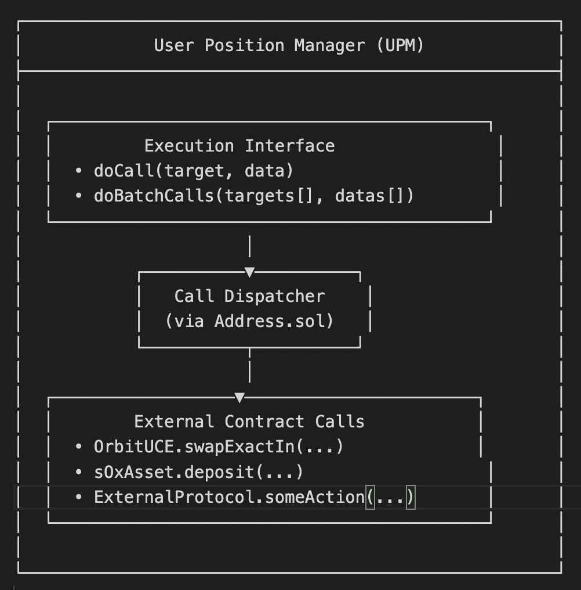

# Architecture

<figure><figcaption></figcaption></figure>

Key Properties

1. Stateless: No user state stored between transactions
2. Permissionless: Anyone can call UPM functions
3. Non-custodial: Never holds user tokens permanently
4. Composable: Works with any external contract
5. Gas-efficient: Minimal overhead compared to direct calls
