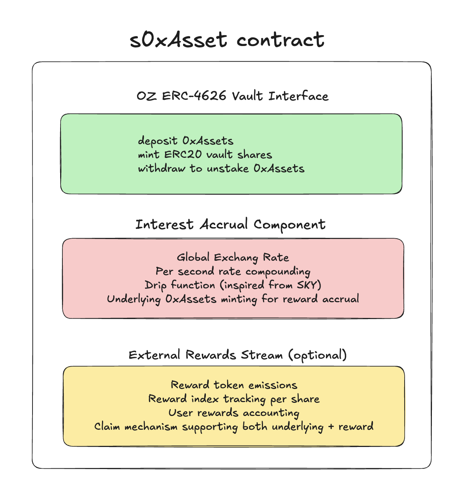

# Architecture



### Core Vault Layer (ERC-4626)

<figure><figcaption></figcaption></figure>



### Core ORBT staking layer (Rewards Distribution)

<figure><figcaption></figcaption></figure>



### Governance Integration Layer

The USM integrates with the ORBT governance system for secure rate management.

Supported governance actions:

* ACT\_SET\_RATE: Update the per-second interest rate
* ACT\_SET\_REWARD\_CONFIG: Configure external reward token emissions
* ACT\_SET\_REWARDS\_ONLY\_MODE: Toggle between full accrual and rewards-only mode

&#x20;Governance interface that is implemented for executing each action respectively:

```solidity
interface IGovernedContract {
    function executeGovernanceAction(bytes32 actionType, bytes calldata payload) external returns (bool);
}
```


