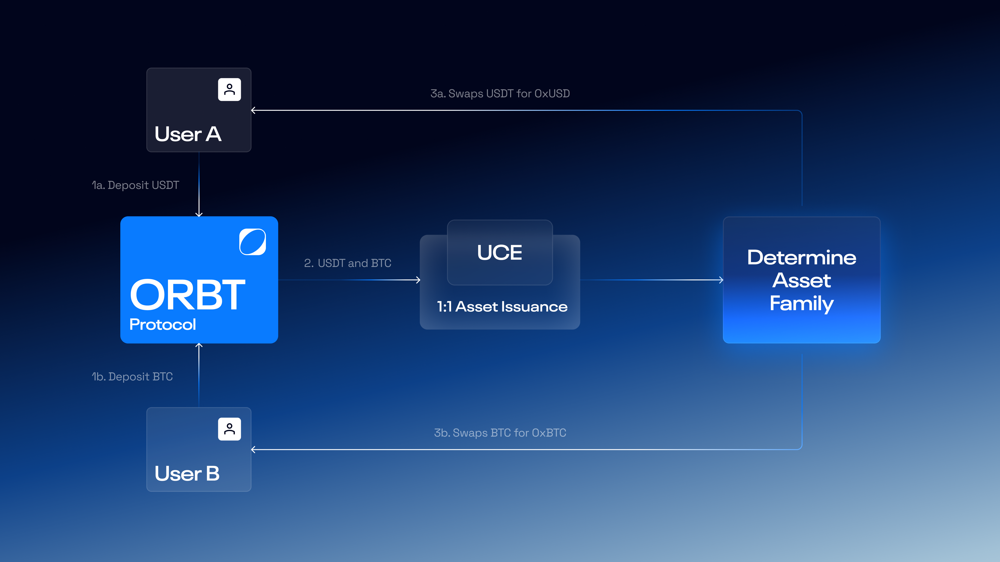

# How to buy 0xAssets

0xAssets represent on-chain, collateral-backed synthetic assets within the ORBT ecosystem.\
They can be acquired by swapping them directly via the ORBT protocol.

<figure><figcaption></figcaption></figure>

***

#### Using the dApp Interface

Users can acquire [0xAssets ](../orbt-design/0xassets.md)directly through the ORBT protocol interface by depositing supported tokens.\
The workflow is as follows:

* **Connect Wallet:** The user connects a supported Web3 wallet (MetaMask, Rabby, WalletConnect, or any compatible option) to the ORBT dApp.
* **Select Token:** After connecting, the user selects the token they wish to swap (e.g., USDC, USDT, WETH, or WBTC) and enters the amount to exchange.
* **Execute Swap:** When the user confirms the transaction, the [**Peg Stability Module (PSM)**](../orbt-design/uce/) detects the deposited token type and performs a 1:1 swap into the corresponding 0xAsset.
* **Update Balance:** After on-chain confirmation, the [**User Position Manager (UPM)**](../orbt-design/upm/) updates the user’s balance to display the newly acquired 0xAssets.

***

#### Asset Families

Each [**Peg Stability Module(PSM)**](../orbt-design/uce/architecture.md#the-peg-and-liquidity-model) manages a distinct family of collateral assets and swaps its own 0xAsset variant:

<table><thead><tr><th width="164">Asset Family</th><th width="185">Managed Collateral</th><th>Corresponding 0xAsset</th><th>Example Collateral</th></tr></thead><tbody><tr><td><strong>BTC Family UCE</strong></td><td>Bitcoin-backed assets</td><td><code>0xBTC</code></td><td>WBTC, cbBTC, tBTC</td></tr><tr><td><strong>ETH Family UCE</strong></td><td>Ethereum-backed assets</td><td><code>0xETH</code></td><td>WETH, stETH, rETH</td></tr><tr><td><strong>USD Family UCE</strong></td><td>USD stablecoin-backed assets</td><td><code>0xUSD</code></td><td>USDC, USDT, DAI</td></tr></tbody></table>

When users deposit collateral into a specific UCE, it determines the corresponding 0xAsset they will swap.

Example:

* Alice deposits **WETH** → The **ETH Family UCE** swaps **0xETH**.
* Bob deposits **USDC** → The **USD Family UCE** swaps **0xUSD**.
* Charlie deposits **WBTC** → The **BTC Family UCE** swaps **0xBTC**.

***

#### Important to Note

* **Transparency:** All swap transactions are verifiable through ORBT’s subgraph and API.
* **Non-custodial architecture:** Users retain full ownership of assets; smart contracts only act per signed user instructions.
* **Collateral specificity:** Each 0xAsset type is swapped solely within its designated UCE family -  cross-family collateral is not interchangeable.
