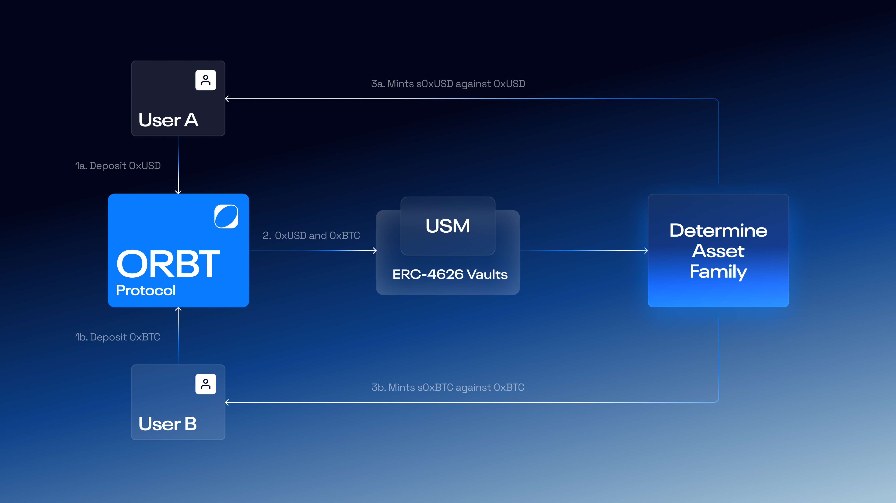

# How to buy s0xAsset

Buying s0xAssets allows holders to earn protocol-generated rewards and participate in yield strategies powered by the ORBT ecosystem.

<figure><figcaption></figcaption></figure>

***

#### Using the dApp Interface

Users in permitted jurisdictions can sell their [0xAssets ](../orbt-design/0xassets.md)directly via the ORBT dApp interface.

The staking workflow is as follows:

1. **Connect Wallet:** The user connects a supported Web3 wallet (e.g., MetaMask, Rabby, WalletConnect) to the ORBT app and navigates to the **Savings** section.
2. **Select Asset:** Choose the 0xAsset they wish to sell(0xUSD, 0xETH, or 0xBTC).
3. **Click “Buy”:** Initiate the buying process, which prompts a wallet signature request.
4. **Sign Transaction:** The user signs the transaction to confirm deposit into the savings module.
5. **Receive sTokens:** Upon confirmation, the 0xAsset is atomically exchanged for its yield-bearing counterpart (e.g., 0xUSD → s0xUSD).

The UI then updates to reflect the updated balance and displays the current APY, total amount deposited, and estimated yield accumulation.
