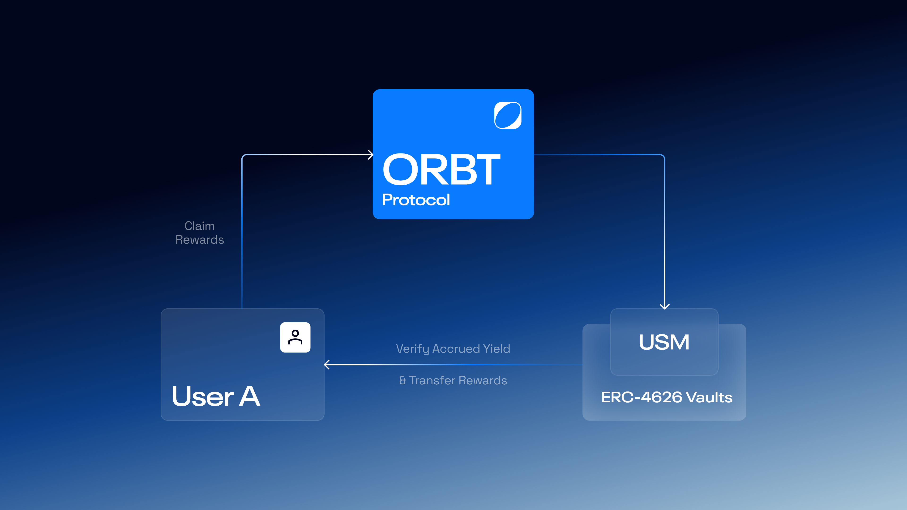

# How to claim yield

Claiming rewards enables users to collect accrued yield generated from [USM](../orbt-design/usm/) or protocol-level participation within the ORBT ecosystem.

<figure><figcaption></figcaption></figure>

***

### Using the dApp interface

Users can claim accrued rewards directly through the ORBT dApp once eligible.

The workflow is as follows:

* **Connect Wallet:** The user connects a supported Web3 wallet (e.g., MetaMask, Rabby, WalletConnect) to the ORBT dApp and navigates to the **Savings** section.
* **View Accrued Rewards:** The interface displays the total accrued yield available to claim, along with deposited balances.
* **Click “Claim Rewards”:** The user initiates the claim process by selecting the **“Claim Rewards”** button.
* **Confirm Transaction:** The user signs a single on-chain transaction to confirm the claim.
* **Receive Rewards:** Upon confirmation, the rewards are automatically transferred to the user’s wallet.
* **Dashboard Update:** The dashboard updates to reflect the claimed rewards and the remaining accrued yield, if any.

***

#### Important to note

* Rewards accumulate automatically within the [**USM** ](../orbt-design/usm/)and can be claimed at any time.
* The **claim action** does not affect the deposit amount - only the accrued yield is transferred.
* All reward verifications and transfers are **on-chain and transparent**, ensuring provable distribution accuracy.
* Unclaimed rewards continue to **accrue until claimed**, with no penalty or expiry.
