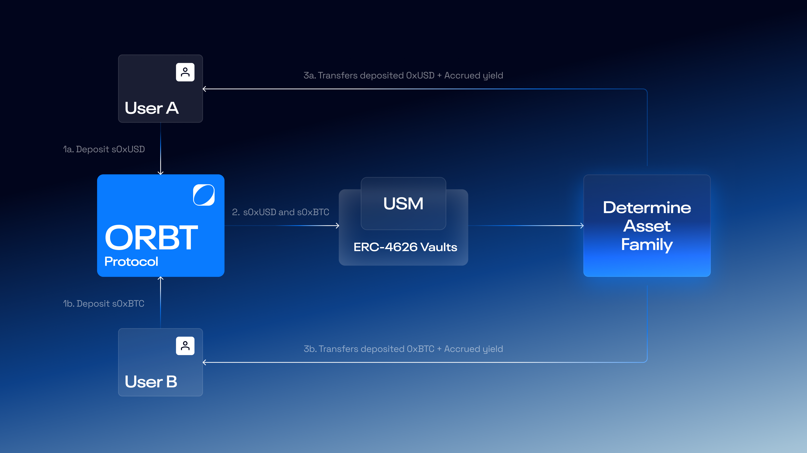

# How to sell s0xAssets

Selling s0xAssets lets users convert their yield-bearing tokens (_s0xUSD, s0xETH, s0xBTC_) back to the original assets they deposited.

<figure><figcaption></figcaption></figure>

***

#### Using the dApp Interface

Users in permitted jurisdictions can redeem their s0xAssets directly via the ORBT interface.

The redeeming workflow is as follows:

1. **Connect Wallet:** The user connects their preferred Web3 wallet (e.g., MetaMask, Rabby, WalletConnect) to the ORBT app.
2. **Select Deposited Asset:** Choose the yield-bearing token they wish to sell - such as s0xUSD, s0xETH, or s0xBTC.
3. **Click “Sell”:** Initiate the redeeming action, which triggers a wallet prompt to sign the transaction.
4. **Sign Transaction:** The user confirms the transaction, which starts the redeeming process on-chain.
5. **Cooldown Period Begins:** Once the transaction is confirmed, the system enters a mandatory cooldown period before withdrawal becomes available for long-term deposited assets.
6. **Withdraw Assets:** After the cooldown expires, the user returns to the interface, clicks **“Withdraw,”** and signs a final transaction to claim their 0xAssets.

Upon successful withdrawal, the user’s s0xAssets are burned, and the corresponding 0xAssets - including any accumulated yield - are transferred back to their wallet or UPM account.

***

#### Important to Note

* **Cooldown Duration:** Each savings pool defines its own cooldown period, typically **7 days,** before 0xAssets can be withdrawn.
* **Reward Accrual:** Rewards continue to accumulate until the sell transaction is confirmed on-chain.
* **Redemption Rate:** The number of 0xAssets received upon withdrawal depends on the **current value of s0xAssets** at the time of redemption, not at the time of depositing.
* **Non-Decreasing Value:** The redemption rate for s0xAssets never decreases, ensuring users only receive equal or greater value than their initial deposit.
* **Transparency:** Users can monitor the cooldown status and redeem transactions directly via the ORBT dApp dashboard or the on-chain subgraph.
